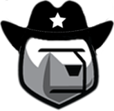

# NetWrangler



Table of Contents
* [Introduction](#introduction)
* [Using NetWrangler](#using-netwrangler)
* [Building NetWrangler](#building-netwrangler)
* [Cross Compiling](#cross-compiling)
* [Contributing](#contributing)
* [Input Configuration File Format](#input-configuration-file-format)
* [License](#license)


## Introduction
NetWrangler is a one-shot network interface configuration utility that
is mostly compatible with [https://netplan.io](https://netplan.io)
configuration files.  Key differences are:

* It only supports systemd-networkd and old-style Redhat network
  configurations as output formats.  Debian style is a planned on, and
  NetworkManager style is a lower priority.
* No support for configuring wireless interfaces.  This tool is mainly
  intended for servers and other devices that do not have wireless
  interfaces.
* No daemons, dynamic configuration, or other long-lived operations.
  This tool is intended to be run as part of device provisioning,
  where we expect to set the desired network interface config once and
  then forget about it until it is time to reprovision the box.
* No support for hierarchical config files.  We use the netplan.io
  YAML for its schema, not to allow additional layered customization.
* No support for NIC renaming or MAC address reassignment.  Support
  may be added at a later date.
* No support for per-interface backend renderers.  This just doesn't
  seem like a good idea if you don;t care about dynamic interface
  reconfiguration.

## Using NetWrangler

There are extensive example configuration files for various network
configuration implementations which can be found in the
[test-data](https://github.com/rackn/netwrangler/tree/master/test-data)
directory.

For basic command usage, use the `--help` switch to the compiled
binary for more details.  Example usage (not guaranteed to be up
to date with current usage output):

```shell
$ netwrangler --help
Usage of cmd/netwrangler:
  -bindMacs
    	Whether to write configs that force matching physical devices on MAC address
  -dest string
    	Location to write output to.  Defaults to stdout.
  -in string
    	Format to expect for input. Options: netplan, internal (default "netplan")
  -op string
    	Operation to perform.
    	"gather" gathers information about the physical nics on the system in a form that can be used later with the -phys option
    	"compile" translates the -in formatted network spec from -src to -out formatted data at -dest
  -out string
    	Format to render input to.  Options: systemd, rhel, internal (default "systemd")
  -phys string
    	File to read to gather current physical nics.  Defaults to reading them from the kernel.
  -src string
    	Location to get input from.  Defaults to stdin.
2019/03/21 10:34:16 flag: help requested
```

## Building NetWrangler

NetWrangler is a Go Lang project, and is simple to build.  Please
install Go version 1.10 or newer (older versions may work but have
not been tested).  See [https://golang.org/doc/install[(https://golang.org/doc/install)

In the future, compiled builds may be provided.

These examples work on Linux or Mac.  You may need to adjust directories
appropriately for your Go environment.  Check out the source code:

```shell
go get github.com/rackn/netwrangler
```

This will checkout the code and (generally) put it in:

`$HOME/go/src/github.com/rackn/netwrangler`

To build it, change to the netwrangler directory and run the build script,
and copy the binary to your path or remote system:

```shell
cd $HOME/go/src/github.com/rackn/netwrangler
tools/build.sh
cp cmd/netwrangler /usr/local/bin
```


## Cross Compiling

Standard Go Lang cross compiling methodology works here, see:
https://golang.org/doc/install/source#environment

Example of compiling for Linux 64bit, when on macOS:

`env GOOS=linux GOARCH=amd64 tools/build.sh`


## Contributing

We encourage contributions to help expand and enhance the functionality
of the NetWrangler project.  We operate in a standard "Pull Request" (PR)
git workflow model.

We also require that contributors sign a Contributor's License Agreement.
We believe that this helps protect both you the contributor, and the
project at large.  You can find our philosophy on this summarized by the
excellent [post by Julian Ponge](https://julien.ponge.org/blog/in-defense-of-contributor-license-agreements/
).  For reference, we have copied this post to a
[GIST backup](https://gist.githubusercontent.com/sygibson/6b485dabe31be5c8cf32d9ffd321908c/raw/46de6d2dca0dbe97fc55042fb2f7e33f1a799e6f/why-cla.txt).

You may sign the CLA in advance of submitting changes by visiting:

* [https://cla-assistant.io/rackn/netwrangler](https://cla-assistant.io/rackn/netwrangler)

When you create your first Pull Request, you will be required to sign
the CLA if you have not yet done so.

If you have some changes you'd like to make, we ask that you drop by and
chat with us via Slack, sign up at:

* [https://rackn.com/support/slack/](https://rackn.com/support/slack/)

Please put "netwrangler" in the "I'm interested in" field.

We will add you to the [NetWrangler Members](https://github.com/orgs/rackn/teams/netwrangler/members)
for write access to the repository.

For small fixes and enhancements, please go ahead and submit a PR, with
sufficient comments for us to understand what your intentions are.

If you would like to add a new configuration method (for example, add
full NetworkManager) support, please drop us a note and let us know,
we'd appreciate it.


## Input Configuration File Format

The configuration input is via the [netplan.io](https://netplan.io/) DSL.
Please refer to it for full details.

## License

NetWrangler is [Apache License 2.0](https://github.com/rackn/netwrangler/blob/master/LICENSE).
